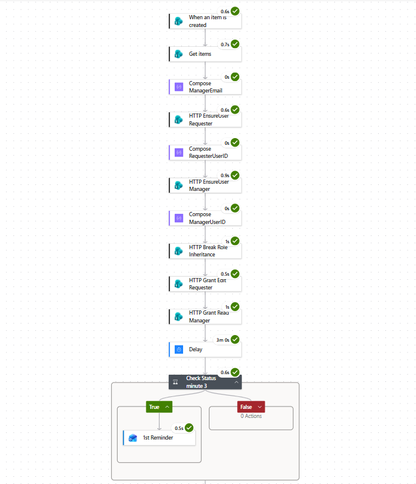
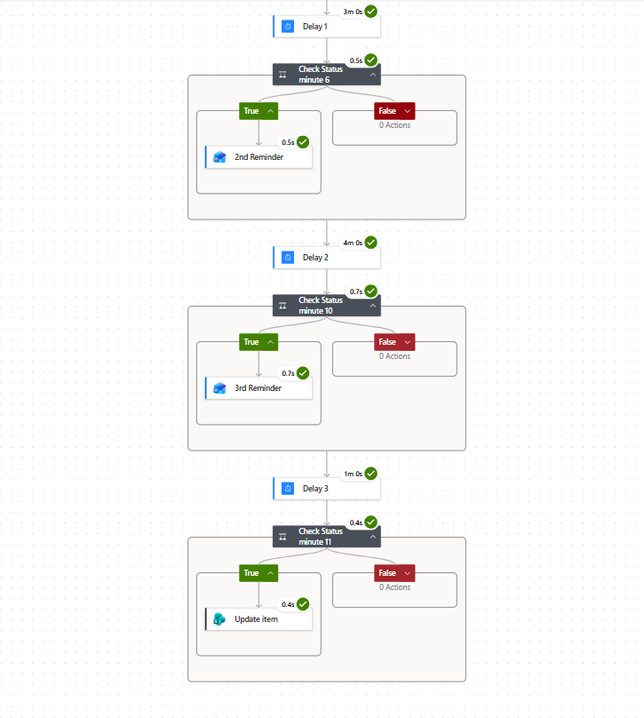
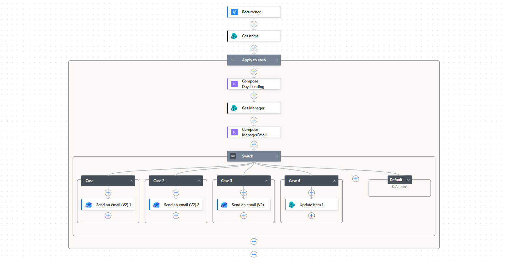

# Employee Leave Management & Manager Approval System (SPFx)


## 📋 Overview

The **Employee Leave Management & Manager Approval System** is an enterprise-grade client-side solution developed using the **SharePoint Framework (SPFx)**, **React**, **PnP JS v4**, and **Microsoft Graph API**. It provides an intuitive, responsive interface for employees to submit and track leave applications, while granting managers role-scoped dashboards to review, approve, or reject leave requests submitted by their reporting team members.

---

## 🌟 Key Features

### 🏢 Employee Capabilities
- **Apply for Leave**: Submit leave requests with automatic validation for mandatory fields, valid date ranges (End Date $\ge$ Start Date), and reason length limits.
- **Track & Filter**: View applications with real-time status badges (`Pending`, `Approved`, `Rejected`), keyword search (Employee Name or Leave Type), and status filtering.
- **Edit & Cancel**: Modify or cancel pending leave applications prior to manager action.

### 👨‍💼 Manager Approval & Dashboard
- **Role-Based Access**: Automatically detects if the logged-in user is a manager via `Manager_List` mapping and unlocks the **Manager Dashboard (Team Requests)** tab.
- **Data Scoping & Privacy**: Scopes data so managers can only view and manage leave applications from employees reporting directly to them.
- **Approve / Reject Workflow**: One-click approval or rejection with custom **Manager Comments** saved directly to SharePoint.

### ✉️ Microsoft Graph API Email Notifications
- Automatically dispatches styled HTML email notifications to the employee's designated manager upon leave submission.
- Uses **Microsoft Graph API (`MSGraphClientV3`)** with `Mail.Send` scope instead of standard legacy SharePoint email APIs.
- Emails include full application details and a direct action button to open the Manager Dashboard.

### 🎨 Site Navigation Sidebar (Application Customizer Extension)
- **SiteSidebar Application Customizer**: Custom SPFx Extension (`SiteSidebarApplicationCustomizer.ts`) that injects a responsive drawer menu.
- **Clean View Mode**: Automatically hides default SharePoint suite bars, left app bars, hero banners, and footers for a distraction-free user experience.

### 📎 Multi-File Attachments (`FileUploadControl`)
- **Drag & Drop Attachment Upload**: Integrated Fluent UI `FileUploadControl` in `LeaveRequestForm.tsx` supporting multi-file drag and drop, file size limits (10 MB/file), max file count validations (5 files), and PnPjs item attachment uploads.

---

## 📂 SharePoint List Requirements

### 1. `Employee Leave Requests` List
| Column Name | Column Type | Required | Description |
|---|---|---|---|
| `Title` | Single line of text | Yes | Auto-generated (`Employee Name - Leave Type`) |
| `EmployeeName` | Person or Group | Yes | Requester |
| `LeaveType` | Choice | Yes | `Casual Leave`, `Sick Leave`, `Annual Leave`, `Other` |
| `StartDate` | Date and Time | Yes | Leave Start Date |
| `EndDate` | Date and Time | Yes | Leave End Date |
| `Reason` | Multiple lines of text | No | Detailed reason (Max 500 characters) |
| `Status` | Choice | Yes | Default: `Pending` (Options: `Pending`, `Approved`, `Rejected`) |
| `ManagerComments` | Multiple lines of text | No | Remarks provided by manager during approval/rejection |

### 2. `Manager_List` List (Team Mapping)
| Column Name | Column Type | Required | Description |
|---|---|---|---|
| `Manager` | Person or Group | Yes | Manager user object |
| `Member` | Person or Group (Multi-select supported) | Yes | Employee(s) reporting to this manager |

### 3. `LogHistory` List (Optional)
| Column Name | Column Type | Description |
|---|---|---|
| `Title` | Single line of text | Page and Function Name |
| `FunctionName` | Single line of text | Function where error occurred |
| `PageName` | Single line of text | Component/Service module |
| `ErrorMessage` | Multiple lines of text | Error details |
| `StackTrace` | Multiple lines of text | Full call stack trace |

---

## 💻 Tech Stack & Dependencies

- **Framework**: SPFx 1.23.2
- **UI Libraries**: `@fluentui/react` (v8)
- **Data Access**: `@pnp/sp` (v4)
- **API Integration**: `@microsoft/sp-http` (`MSGraphClientV3`)
- **Build Orchestrator**: Heft (Rush Stack toolchain)
- **Node Compatibility**: Node v18.x LTS

---

## 📚 Guides & Power Automate Workflow Diagrams

For detailed technical guides and architecture breakdown, refer to the included documentation:

1. **[SPFx Developer Guide](SPFx_Developer_Guide.md)**: Deep dive into project architecture, service patterns, and SPFx standards.
2. **[SPFx Execution Flow & Debugging Guide](SPFx_Execution_Flow_and_Debugging_Guide.md)**: Step-by-step lifecycle flow, call hierarchy, and debugging instructions.
3. **[SharePoint Item-Level Permissions & Power Automate Guide](SharePoint_Item_Level_Permissions_Power_Automate.md)**: Complete guide for setting up item-level security, break permission inheritance, 3-6-10 day reminder escalations, and recurrent batch schedulers.

### ⚡ Power Automate Flow Screenshots

| Part 1: Item Permissions & Manager Lookup | Part 2: 3-6-10 Day Escalations | Part 3: Recurrent Reminder Scheduler |
| :---: | :---: | :---: |
|  |  |  |

---

## 🚀 Development & Local Workbench Workflow

### Prerequisites
- Node.js v18.x (`nvm use 18`)
- M365 Developer Tenant

```bash
# 1. Install dependencies
npm install

# 2. Trust developer SSL certificate (run once)
npx heft trust-dev-cert

# 3. Launch local workbench server
npx heft start
```

---

## 📦 Deployment Guide (Step-by-Step)

Follow these step-by-step instructions to deploy the solution to your tenant:

### Step 1: Build & Package the Solution
Run the production build script in your terminal:
```bash
npm run build
```
*This command executes `heft test --clean --production && heft package-solution --production` and generates the ready-to-deploy package file at:*
`sharepoint/solution/crud-webpart-sp.sppkg`

---

### Step 2: Deploy `.sppkg` to SharePoint App Catalog
1. Open your tenant **SharePoint App Catalog** site:
   `https://<your-tenant>.sharepoint.com/sites/appcatalog` (or **Apps for SharePoint** under SharePoint Admin Center).
2. Drag and drop `sharepoint/solution/crud-webpart-sp.sppkg` into the **Apps for SharePoint** library.
3. In the deployment dialog:
   - Check **"Enable this app and add it to all sites"** (or deploy to specific site collections).
   - Click **Enable app**.

---

### Step 3: Approve Microsoft Graph API Permissions (Critical for Email)
Since email notifications use Microsoft Graph API:
1. Open **SharePoint Admin Center**:
   `https://<your-tenant>-admin.sharepoint.com`
2. In the left navigation menu, expand **Advanced** $\rightarrow$ select **API access**.
3. Under **Pending requests**, locate the request for **Microsoft Graph** with scope **`Mail.Send`**.
4. Select the request and click **Approve**.

---

### Step 4: Add WebPart to a SharePoint Site Page
1. Navigate to your target SharePoint site (e.g., `https://<your-tenant>.sharepoint.com/sites/ReactDemo`).
2. Ensure both **`Employee Leave Requests`** and **`Manager_List`** lists exist on the site.
3. Edit an existing page or create a new Site Page titled **"Employee Leave Requests"**.
4. Click the **+** (Add a new web part) button on the canvas.
5. Search for **`CrudOperation`** (or **Employee Leave Requests**) and insert it.
6. Click **Publish** at the top right.

---

## ⚙️ Local Configuration & Workbench Setup

To run the webpart locally in hosted workbench:
1. Copy `config/serve.json.example` to `config/serve.json`:
   ```bash
   cp config/serve.json.example config/serve.json
   ```
2. Update the `initialPage` URL in `config/serve.json` to point to your tenant's SharePoint workbench:
   `https://<your-tenant>.sharepoint.com/sites/<your-site>/_layouts/15/workbench.aspx`
3. Note: `config/serve.json` is listed in `.gitignore` so your personal/company tenant URL will not be tracked or committed to GitHub.

---

## 📄 License & Usage

This project is maintained as an open-source reference guide for **SharePoint Framework (SPFx) & React Developers**.