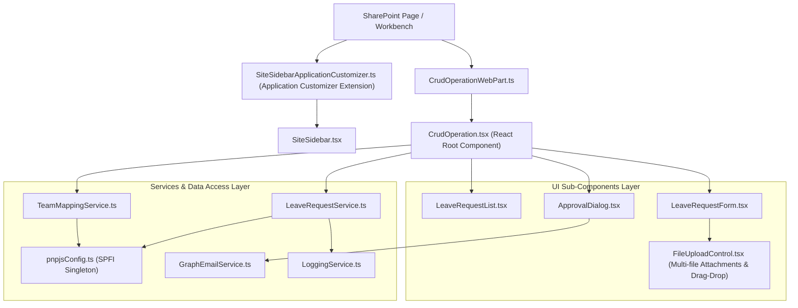
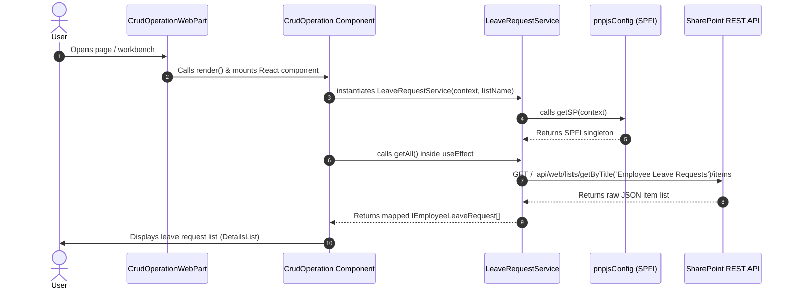

# SPFx Application Execution Flow & Debugging Guide

This document provides an accurate, deep-dive reference for the execution flow, class/function call hierarchy, and a step-by-step debugging guide for the **First_SPTASK** SharePoint Framework (SPFx v1.23 using Rushstack Heft) application.

---

## 📋 Table of Contents
1. [Architecture Overview](#-architecture-overview)
2. [Application Startup & Execution Flow](#-application-startup--execution-flow)
   - [Phase 1: SPFx Web Part Initialization](#phase-1-spfx-web-part-initialization)
   - [Phase 2: React Component Mounting & Service Wiring](#phase-2-react-component-mounting--service-wiring)
   - [Phase 3: Lifecycle Hooks & Asynchronous Data Fetching](#phase-3-lifecycle-hooks--asynchronous-data-fetching)
   - [Phase 4: Sub-Components & User Interaction Flow](#phase-4-sub-components--user-interaction-flow)
3. [Class & Function Call Hierarchy](#-class--function-call-hierarchy)
4. [PnPjs Configuration & Singleton Pattern](#-pnpjs-configuration--singleton-pattern)
5. [Comprehensive Debugging Quick Guide](#-comprehensive-debugging-quick-guide)
   - [Option A: Chrome / Edge Developer Tools Debugging](#option-a-chrome--edge-developer-tools-debugging)
   - [Option B: VS Code Debugger Setup](#option-b-vs-code-debugger-setup)
   - [Option C: Network Request & REST API Diagnostics](#option-c-network-request--rest-api-diagnostics)
   - [Option D: Troubleshooting & Common Fixes](#option-d-troubleshooting--common-fixes)

---

## 📐 Architecture Overview

The application follows a modular, multi-tier architecture separating SPFx Web Part containers, React UI components, business logic services, and core framework utilities:



---

## 🚀 Application Startup & Execution Flow

### Phase 1: SPFx Web Part Initialization
1. **Bundle Loading:** SharePoint loads the compiled JavaScript bundle defined by [`CrudOperationWebPart.manifest.json`](file:///c:/Users/AbhishekSoni/Documents/atQor_Projects/First_SPTASK/src/webparts/crudOperation/CrudOperationWebPart.manifest.json).
2. **Web Part Instantiation:** SPFx instantiates the [`CrudOperationWebPart`](file:///c:/Users/AbhishekSoni/Documents/atQor_Projects/First_SPTASK/src/webparts/crudOperation/CrudOperationWebPart.ts#L20) class extending `BaseClientSideWebPart`.
3. **`render()` Execution:** The SPFx runtime calls the [`render()`](file:///c:/Users/AbhishekSoni/Documents/atQor_Projects/First_SPTASK/src/webparts/crudOperation/CrudOperationWebPart.ts#L22) method:
   ```typescript
   public render(): void {
     const element: React.ReactElement<ICrudOperationProps> = React.createElement(
       CrudOperation,
       {
         listName: this.properties.listName || LIST_NAMES.EMPLOYEE_LEAVE_REQUESTS,
         context: this.context
       }
     );
     ReactDom.render(element, this.domElement);
   }
   ```

---

### Phase 2: React Component Mounting & Service Wiring
1. **React Element Mount:** [`CrudOperation.tsx`](file:///c:/Users/AbhishekSoni/Documents/atQor_Projects/First_SPTASK/src/webparts/crudOperation/components/CrudOperation.tsx#L33) receives `context` and `listName` props.
2. **Service Instantiation:**
   - [`LeaveRequestService`](file:///c:/Users/AbhishekSoni/Documents/atQor_Projects/First_SPTASK/src/webparts/crudOperation/services/LeaveRequestService.ts#L42) is instantiated via `useMemo`.
   - [`TeamMappingService`](file:///c:/Users/AbhishekSoni/Documents/atQor_Projects/First_SPTASK/src/framework/Services/TeamMappingService.ts) is instantiated via `useMemo`.
3. **PnPjs Singleton Setup:** The constructor of [`LeaveRequestService`](file:///c:/Users/AbhishekSoni/Documents/atQor_Projects/First_SPTASK/src/webparts/crudOperation/services/LeaveRequestService.ts#L46) executes [`getSP(context)`](file:///c:/Users/AbhishekSoni/Documents/atQor_Projects/First_SPTASK/src/framework/Services/pnpjsConfig.ts#L17) in [`pnpjsConfig.ts`](file:///c:/Users/AbhishekSoni/Documents/atQor_Projects/First_SPTASK/src/framework/Services/pnpjsConfig.ts):
   ```typescript
   export const getSP = (context?: BaseComponentContext): SPFI => {
     if (_sp === undefined) {
       if (!context) {
         throw new Error('SPFx Context must be provided on initial getSP call.');
       }
       _sp = spfi().using(SPFx(context));
     }
     return _sp;
   };
   ```

---

### Phase 3: Lifecycle Hooks & Asynchronous Data Fetching
1. **User Role & Team Mapping (`useEffect #1`):**
   - [`teamMappingService.isUserAManager(userEmail, userLogin, userName)`](file:///c:/Users/AbhishekSoni/Documents/atQor_Projects/First_SPTASK/src/webparts/crudOperation/components/CrudOperation.tsx#L65) checks if the current user is a manager.
   - If `isManager === true`, fetches direct reports via [`teamMappingService.getManagedTeamMembers(...)`](file:///c:/Users/AbhishekSoni/Documents/atQor_Projects/First_SPTASK/src/webparts/crudOperation/components/CrudOperation.tsx#L69).
2. **Leave Requests Data Fetching (`useEffect #2`):**
   - Triggers [`loadItems()`](file:///c:/Users/AbhishekSoni/Documents/atQor_Projects/First_SPTASK/src/webparts/crudOperation/components/CrudOperation.tsx#L80), calling [`LeaveRequestService.getAll()`](file:///c:/Users/AbhishekSoni/Documents/atQor_Projects/First_SPTASK/src/webparts/crudOperation/services/LeaveRequestService.ts#L53).
   - `getAll()` runs the PnPjs query:
     ```typescript
     const items: IRawLeaveRequestItem[] = await this._items
       .select(...LEAVE_SELECT_FIELDS)
       .expand('EmployeeName')
       .orderBy('Id', false)
       .top(500)();
     ```
   - Maps SharePoint raw JSON objects to `IEmployeeLeaveRequest` models.
   - Sets component state: `setItems(results)` and `setIsLoading(false)`.

---

### Phase 4: Sub-Components & User Interaction Flow



---

### Phase 5: Application Customizer (Site Navigation Sidebar Extension)
1. **Extension Entry Point:** SPFx loads [`SiteSidebarApplicationCustomizer.ts`](file:///c:/Users/AbhishekSoni/Documents/atQor_Projects/First_SPTASK/src/extensions/siteSidebar/SiteSidebarApplicationCustomizer.ts#L19) extending `BaseApplicationCustomizer`.
2. **Clean View CSS Injection:** `onInit()` calls `_injectCleanViewCSS()` to hide standard SharePoint O365 suite bars, left navigation, app bar, hero banners, and footers for a focused view.
3. **Placeholder & DOM Fallback Mounting:**
   - Evaluates `PlaceholderName.Top`. If unavailable, creates a persistent root container `div#spfx-site-sidebar-root` directly on `document.body`.
   - Renders [`SiteSidebar.tsx`](file:///c:/Users/AbhishekSoni/Documents/atQor_Projects/First_SPTASK/src/extensions/siteSidebar/components/SiteSidebar.tsx) with toggle drawer state stored in `sessionStorage`.

---

### Phase 6: Multi-File Attachment Handling (`FileUploadControl.tsx`)
1. **Component:** [`FileUploadControl.tsx`](file:///c:/Users/AbhishekSoni/Documents/atQor_Projects/First_SPTASK/src/webparts/crudOperation/components/FileUploadControl.tsx) integrated inside `LeaveRequestForm.tsx`.
2. **Key Capabilities:**
   - **Drag-and-Drop & File Picker Integration:** Handles HTML5 drag-and-drop events (`onDragOver`, `onDrop`) alongside file input dialogs.
   - **Validation:** Enforces maximum file count limits (default 5 files), individual file size limits (default 10 MB), and duplicate filename checks.
   - **Service Upload:** `LeaveRequestService.addAttachments(itemId, files)` uploads binary attachments via PnPjs item attachment endpoints.

---

## 📞 Class & Function Call Hierarchy

| Step | Caller File / Class | Function Called | Target File / Class | Description |
| :--- | :--- | :--- | :--- | :--- |
| **1** | SPFx Framework | `render()` | [`CrudOperationWebPart.ts`](file:///c:/Users/AbhishekSoni/Documents/atQor_Projects/First_SPTASK/src/webparts/crudOperation/CrudOperationWebPart.ts#L22) | Main web part entry point |
| **2** | [`CrudOperationWebPart.ts`](file:///c:/Users/AbhishekSoni/Documents/atQor_Projects/First_SPTASK/src/webparts/crudOperation/CrudOperationWebPart.ts) | `ReactDom.render()` | [`CrudOperation.tsx`](file:///c:/Users/AbhishekSoni/Documents/atQor_Projects/First_SPTASK/src/webparts/crudOperation/components/CrudOperation.tsx#L33) | Mounts React UI |
| **3** | [`CrudOperation.tsx`](file:///c:/Users/AbhishekSoni/Documents/atQor_Projects/First_SPTASK/src/webparts/crudOperation/components/CrudOperation.tsx) | `constructor()` | [`LeaveRequestService.ts`](file:///c:/Users/AbhishekSoni/Documents/atQor_Projects/First_SPTASK/src/webparts/crudOperation/services/LeaveRequestService.ts#L45) | Instantiates service |
| **4** | [`LeaveRequestService.ts`](file:///c:/Users/AbhishekSoni/Documents/atQor_Projects/First_SPTASK/src/webparts/crudOperation/services/LeaveRequestService.ts) | [`getSP(context)`](file:///c:/Users/AbhishekSoni/Documents/atQor_Projects/First_SPTASK/src/framework/Services/pnpjsConfig.ts#L17) | [`pnpjsConfig.ts`](file:///c:/Users/AbhishekSoni/Documents/atQor_Projects/First_SPTASK/src/framework/Services/pnpjsConfig.ts#L17) | Initializes PnPjs Singleton |
| **5** | [`CrudOperation.tsx`](file:///c:/Users/AbhishekSoni/Documents/atQor_Projects/First_SPTASK/src/webparts/crudOperation/components/CrudOperation.tsx) | `useEffect()` -> [`loadItems()`](file:///c:/Users/AbhishekSoni/Documents/atQor_Projects/First_SPTASK/src/webparts/crudOperation/components/CrudOperation.tsx#L80) | [`LeaveRequestService.ts`](file:///c:/Users/AbhishekSoni/Documents/atQor_Projects/First_SPTASK/src/webparts/crudOperation/services/LeaveRequestService.ts#L53) | Fetches list data |
| **6** | [`LeaveRequestService.ts`](file:///c:/Users/AbhishekSoni/Documents/atQor_Projects/First_SPTASK/src/webparts/crudOperation/services/LeaveRequestService.ts) | `getAll()` | SharePoint REST API | Queries `_sp.web.lists` |
| **7** | [`LeaveRequestService.ts`](file:///c:/Users/AbhishekSoni/Documents/atQor_Projects/First_SPTASK/src/webparts/crudOperation/services/LeaveRequestService.ts) | [`LoggingService.logError(...)`](file:///c:/Users/AbhishekSoni/Documents/atQor_Projects/First_SPTASK/src/framework/Services/LoggingService.ts) | [`LoggingService.ts`](file:///c:/Users/AbhishekSoni/Documents/atQor_Projects/First_SPTASK/src/framework/Services/LoggingService.ts) | Logs error if request fails |

---

## 🛠️ PnPjs Configuration & Singleton Pattern

File: [`src/framework/Services/pnpjsConfig.ts`](file:///c:/Users/AbhishekSoni/Documents/atQor_Projects/First_SPTASK/src/framework/Services/pnpjsConfig.ts)

```typescript
import { BaseComponentContext } from '@microsoft/sp-component-base';
import { spfi, SPFI, SPFx } from '@pnp/sp';
import '@pnp/sp/webs';
import '@pnp/sp/lists';
import '@pnp/sp/items';
import '@pnp/sp/folders';
import '@pnp/sp/files';
import '@pnp/sp/site-users/web';

let _sp: SPFI | undefined = undefined;

/**
 * Returns a singleton instance of SPFI configured for SPFx context.
 * @param context - BaseComponentContext optional if already initialized
 */
export const getSP = (context?: BaseComponentContext): SPFI => {
  if (_sp === undefined) {
    if (!context) {
      throw new Error('SPFx Context must be provided on initial getSP call.');
    }
    _sp = spfi().using(SPFx(context));
  }
  return _sp;
};
```

### Key Principles of `pnpjsConfig.ts`:
1. **Singleton Pattern (`_sp`):** Ensures only one instance of `SPFI` exists per web part session, preventing memory leaks and redundant HTTP client creation.
2. **Context Requirement:** The first call MUST pass the SPFx `BaseComponentContext` (`this.context`), after which `getSP()` can be called without parameters elsewhere in the framework.
3. **Module Imports:** Selectively imports PnPjs modules (`webs`, `lists`, `items`, `site-users/web`) to keep bundle sizes lean.

---

## 🔍 Comprehensive Debugging Quick Guide

### Option A: Chrome / Edge Developer Tools Debugging

1. **Launch Dev Server with Heft:**
   Run via npm scripts or Heft CLI:
   ```bash
   npm start
   # Or using Heft directly:
   heft start --clean
   ```
2. **Open Browser DevTools:** Press `F12` or `Ctrl + Shift + I`.
3. **Locate Source Files:**
   - Navigate to **Sources** tab -> Press `Ctrl + P`.
   - Search for target files:
     - `CrudOperationWebPart.ts`
     - `CrudOperation.tsx`
     - `LeaveRequestService.ts`
   - *Source Path:* `webpack://` -> `.` -> `src/webparts/crudOperation/...`
4. **Place Breakpoints:**
   - **Render Check:** [`CrudOperationWebPart.ts`](file:///c:/Users/AbhishekSoni/Documents/atQor_Projects/First_SPTASK/src/webparts/crudOperation/CrudOperationWebPart.ts#L22) line 22 (`render()`).
   - **Data Query Check:** [`LeaveRequestService.ts`](file:///c:/Users/AbhishekSoni/Documents/atQor_Projects/First_SPTASK/src/webparts/crudOperation/services/LeaveRequestService.ts#L54) line 54 (`getAll()`).
   - **State Updates:** [`CrudOperation.tsx`](file:///c:/Users/AbhishekSoni/Documents/atQor_Projects/First_SPTASK/src/webparts/crudOperation/components/CrudOperation.tsx#L84) line 84 (`loadItems()`).

---

### Option B: VS Code Debugger Setup

1. Go to **Run and Debug** (`Ctrl + Shift + D`) in VS Code.
2. Select **Hosted Workbench** or **Launch Chrome**.
3. Press **F5**.
4. Set breakpoints directly inside your source files in VS Code. Execution will pause when triggered in the browser.

---

### Option C: Network Request & REST API Diagnostics

1. Open DevTools -> **Network** tab.
2. Filter by `_api/` or `items`.
3. Perform operations (Create, Edit, Delete, Approve).
4. **Diagnostic Status Matrix:**

| Status Code | Failure Cause | Root Cause & Resolution |
| :--- | :--- | :--- |
| **`400 Bad Request`** | Invalid OData parameters | Field internal name mismatch. Verify `LEAVE_SELECT_FIELDS` against list schema. |
| **`404 Not Found`** | Missing SharePoint List | SharePoint list titled `'Employee Leave Requests'` does not exist on the current web site. |
| **`401 / 403 Unauthorized`** | Security / Scope issue | User lacks edit/view permissions or Graph API permission scopes are not granted in SharePoint Admin. |
| **`500 Internal Error`** | SharePoint Server error | Inspect response body in Network tab -> Preview tab for exact exception message. |

---

### Option D: Troubleshooting & Common Fixes

#### 1. "SPFx Context must be provided on initial getSP call"
* **Cause:** `getSP()` was called somewhere in your code before `LeaveRequestService` initialized it with `this.context`.
* **Fix:** Ensure all service constructors receive `this.context` and invoke `getSP(context)`.

#### 2. Leave Request Person Field Null / Undefined
* **Cause:** Forgotten `.expand('EmployeeName')` in PnPjs query.
* **Fix:** Verify `LeaveRequestService.ts` contains `.select(...LEAVE_SELECT_FIELDS).expand('EmployeeName')`.

#### 3. Changes Not Reflecting or Rebuild Issues
* **Fix:** Clean and rebuild using Heft npm commands:
  ```bash
  npm run clean
  npm run build
  npm start
  ```
  Or using Heft directly:
  ```bash
  heft clean
  heft test --clean --production
  heft start --clean
  ```
