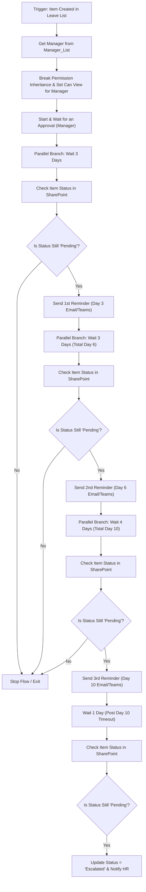

# SharePoint Item-Level Permission & Reminder Escalation Security Guide (Power Automate)

## 1. Overview & Validation of Your Requirement

### Requirement
When an employee submits a new request in a SharePoint list:
* Only the **Employee (Requester)** and their **Manager** should have access to view/edit the list item.
* Other users present in the backend SharePoint list must **NOT** be able to see or access this item.
* Manager assignments are dynamically retrieved from a SharePoint **Manager_List**, where:
  * **`Manager`**: Stores the Manager user/person object or name.
  * **`Member`**: Stores multiple employee/member objects (e.g. `adani demo8`, `Demo1`).
* **Reminder & Escalation Schedule**:
  * **Day 3**: 1st reminder sent to Manager if leave request remains `Pending`.
  * **Day 6**: 2nd reminder sent to Manager if leave request remains `Pending`.
  * **Day 10**: 3rd reminder sent to Manager if leave request remains `Pending`.
  * **After Day 10**: Request status is automatically updated to **`Escalated`** (and HR / Next-Level Manager notified).

---

## 2. Is Your Condition / Approach Correct?

### Yes, but with important caveats!

Breaking permission inheritance on individual items (Item-Level Security) is a standard approach in SharePoint for handling sensitive requests (e.g., HR tickets, performance reviews, expense approvals). 

However, before implementing this via Power Automate, evaluate the following **SharePoint architectural constraints and alternatives**:

### Architecture Comparison Table

| Approach | How it Works | Pros | Cons / Limitations | Recommended For |
| :--- | :--- | :--- | :--- | :--- |
| **Built-in List Item-Level Permissions** | List Settings > Advanced Settings > *Read/Edit items created by user*. | • Zero code/flow required.<br>• Instant execution.<br>• No performance overhead. | • Managers can only see items if they are **Site Owners** or have **Design/Full Control** permissions on the list. | Simple Employee-to-HR/Admin request processes. |
| **Power Automate (Break Inheritance + Reminders)** | Flow breaks inheritance on item creation and handles 3, 6, 10-day reminders and escalation in a single workflow. | • Precise access control (Requester + direct Manager + Owners).<br>• Fully automated reminders & escalations.<br>• Supports custom dynamic `Manager_List`. | • **5,000 Unique Permission Limit per List**.<br>• Flow instance stays active during the reminder periods (up to 30-day Power Automate run limit). | Low to medium volume lists (<5,000 items total or archived regularly). |
| **Separate Target Lists / Power Apps Front-end** | Request submitted to List A (Private), or filtered via Power Apps UI. | • Clean data separation.<br>• High scalability. | • Requires initial setup of frontend application or dual lists. | High volume enterprise request systems (>5,000 items/year). |

> [!WARNING]
> **SharePoint Unique Permission Threshold (5,000 Limit)**
> SharePoint Online permits a maximum of **5,000 unique permission scopes per list**. If your list exceeds 5,000 unique items (where inheritance is broken per item), SharePoint will throw errors and list performance will degrade. 
> * **Best Practice**: If your volume is high, archive completed items to another list or reset permissions after approval/closing.

---

## 3. Step-by-Step Implementation in Power Automate

### Flow Architecture Overview (Permissions + 3, 6, 10 Day Reminder & Escalation)



---

### 📸 Power Automate Workflow Visual Screenshots

| Flow Part 1: Item Permissions & Manager Lookup | Flow Part 2: 3-6-10 Day Escalations & Status Updates |
| :---: | :---: |
|  |  |

#### Flow Part 3: Recurrent Reminder Scheduler Workflow


---


### Step 1 to Step 10: Setting Up Item Permissions & Getting Manager (via HTTP REST API)

> [!NOTE]
> All permission actions below use the **"Send an HTTP request to SharePoint"** action instead of the built-in "Stop Sharing" and "Grant Access" connectors. This gives you full control and avoids connector quirks.

> [!IMPORTANT]
> **Action Card Names Matter!** The names below (e.g. `HTTP_EnsureUser_Requester`) are used in the `outputs('...')` expressions of later steps. **Rename each action card exactly as shown** — otherwise the expressions will break.

#### Step 1 — Trigger

* **Card Name**: `When_a_new_item_is_created`
* **Action**: `SharePoint - When an item is created`
* **List Name**: `'Employee Leave Requests'`

#### Step 2 — Get Manager from Manager_List

* **Card Name**: `Get_items` 
* **Action**: `SharePoint - Get items`
* **List Name**: `Manager_List`
* **Filter Query**: `Member/EMail eq '@{triggerOutputs()?['body/Author/Email']}'`

#### Step 3 — Extract Manager Email

* **Card Name**: `Compose_ManagerEmail`
* **Action**: `Data Operations - Compose`
* **Inputs (Expression)**:
  ```text
  first(outputs('Get_items')?['body/value'])?['Manager']?['Email']
  ```

#### Step 4 — Resolve Requester's User ID (HTTP: EnsureUser)

* **Card Name**: `HTTP_EnsureUser_Requester`
* **Action**: `Send an HTTP request to SharePoint`

| Field | Value |
|:---|:---|
| **Site Address** | `https://yourtenant.sharepoint.com/sites/yoursite` |
| **Method** | `POST` |
| **Uri** | `_api/web/ensureuser` |
| **Headers** | `Accept` : `application/json;odata=verbose` <br> `Content-Type` : `application/json;odata=verbose` |
| **Body** | `{ "logonName": "@{triggerOutputs()?['body/Author/Email']}" }` |

* **Card Name**: `Compose_RequesterUserID`
* **Action**: `Data Operations - Compose`
* **Inputs (Expression)**:
  ```text
  outputs('HTTP_EnsureUser_Requester')?['body']?['d']?['Id']
  ```

> [!TIP]
> **Shortcut**: If the trigger already gives you `AuthorId`, you can skip this step and directly use `triggerOutputs()?['body/AuthorId']` as the Requester's principal ID.

#### Step 5 — Resolve Manager's User ID (HTTP: EnsureUser)

* **Card Name**: `HTTP_EnsureUser_Manager`
* **Action**: `Send an HTTP request to SharePoint`

| Field | Value |
|:---|:---|
| **Site Address** | `https://yourtenant.sharepoint.com/sites/yoursite` |
| **Method** | `POST` |
| **Uri** | `_api/web/ensureuser` |
| **Headers** | `Accept` : `application/json;odata=verbose` <br> `Content-Type` : `application/json;odata=verbose` |
| **Body** | `{ "logonName": "@{outputs('Compose_ManagerEmail')}" }` |

* **Card Name**: `Compose_ManagerUserID`
* **Action**: `Data Operations - Compose`
* **Inputs (Expression)**:
  ```text
  outputs('HTTP_EnsureUser_Manager')?['body']?['d']?['Id']
  ```

#### Step 6 — Get Site Owners Group ID (HTTP)

* **Card Name**: `HTTP_Get_Owners_Group`
* **Action**: `Send an HTTP request to SharePoint`

| Field | Value |
|:---|:---|
| **Site Address** | `https://yourtenant.sharepoint.com/sites/yoursite` |
| **Method** | `GET` |
| **Uri** | `_api/web/associatedownergroup?$select=Id` |
| **Headers** | `Accept` : `application/json;odata=verbose` |
| **Body** | *(leave empty)* |

* **Card Name**: `Compose_OwnersGroupID`
* **Action**: `Data Operations - Compose`
* **Inputs (Expression)**:
  ```text
  outputs('HTTP_Get_Owners_Group')?['body']?['d']?['Id']
  ```

#### Step 7 — Break Role Inheritance (HTTP)

This removes **all** inherited permissions from the item so you can set custom ones.

* **Card Name**: `HTTP_Break_Role_Inheritance`
* **Action**: `Send an HTTP request to SharePoint`

| Field | Value |
|:---|:---|
| **Site Address** | `https://yourtenant.sharepoint.com/sites/yoursite` |
| **Method** | `POST` |
| **Uri** | `_api/web/lists/getbytitle('Employee Leave Requests')/items(@{triggerOutputs()?['body/ID']})/breakroleinheritance(copyRoleAssignments=false, clearSubscopes=true)` |
| **Headers** | `Accept` : `application/json;odata=verbose` |
| **Body** | *(leave empty)* |

> [!CAUTION]
> After this action, **nobody** has access to the item — not even Site Owners. Steps 8, 9, and 10 must follow immediately to restore the correct access.

#### Step 8 — Grant Edit Access to Requester (Member) (HTTP)

* **Card Name**: `HTTP_Grant_Edit_Requester`
* **Action**: `Send an HTTP request to SharePoint`

| Field | Value |
|:---|:---|
| **Site Address** | `https://yourtenant.sharepoint.com/sites/yoursite` |
| **Method** | `POST` |
| **Uri** | `_api/web/lists/getbytitle('Employee Leave Requests')/items(@{triggerOutputs()?['body/ID']})/roleassignments/addroleassignment(principalid=@{outputs('Compose_RequesterUserID')}, roledefid=1073741827)` |
| **Headers** | `Accept` : `application/json;odata=verbose` |
| **Body** | *(leave empty)* |

#### Step 9 — Grant Read Access to Manager (HTTP)

* **Card Name**: `HTTP_Grant_Read_Manager`
* **Action**: `Send an HTTP request to SharePoint`

| Field | Value |
|:---|:---|
| **Site Address** | `https://yourtenant.sharepoint.com/sites/yoursite` |
| **Method** | `POST` |
| **Uri** | `_api/web/lists/getbytitle('Employee Leave Requests')/items(@{triggerOutputs()?['body/ID']})/roleassignments/addroleassignment(principalid=@{outputs('Compose_ManagerUserID')}, roledefid=1073741826)` |
| **Headers** | `Accept` : `application/json;odata=verbose` |
| **Body** | *(leave empty)* |

#### Step 10 — Grant Full Control to Site Owners Group (HTTP)

* **Card Name**: `HTTP_Grant_FullControl_Owners`
* **Action**: `Send an HTTP request to SharePoint`

| Field | Value |
|:---|:---|
| **Site Address** | `https://yourtenant.sharepoint.com/sites/yoursite` |
| **Method** | `POST` |
| **Uri** | `_api/web/lists/getbytitle('Employee Leave Requests')/items(@{triggerOutputs()?['body/ID']})/roleassignments/addroleassignment(principalid=@{outputs('Compose_OwnersGroupID')}, roledefid=1073741829)` |
| **Headers** | `Accept` : `application/json;odata=verbose` |
| **Body** | *(leave empty)* |

> [!NOTE]
> **Role Definition ID Reference:**
> | Role | roledefid |
> |:---|:---|
> | Full Control | `1073741829` |
> | Edit / Contribute | `1073741827` |
> | Read / View Only | `1073741826` |

---

### Step 8: 3-6-10 Day Reminder & Escalation Logic

Add the following actions inside the **SAME EXISTING FLOW**:

#### Phase 1: Day 3 Reminder
1. **Action**: `Control - Delay`
   * **Count**: `3`
   * **Unit**: `Day`
2. **Action**: `SharePoint - Get item`
   * **Site Address**: Your SharePoint Site
   * **List Name**: `'Employee Leave Requests'`
   * **Id**: Dynamic Content `ID` (from trigger)
3. **Action**: `Control - Condition` (Name: `Check_Status_Day_3`)
   * **Condition**: `Status` (from *Get item*) `is equal to` `'Pending'`
   * **If Yes (Still Pending)**:
     * **Action**: `Office 365 Outlook - Send an email (V2)`
       * **To**: Outputs of `Compose_ManagerEmail`
       * **Subject**: `[1st Reminder] Pending Leave Request for @{triggerOutputs()?['body/Author/DisplayName']}`
       * **Body**: `Dear Manager, The leave request submitted on @{triggerOutputs()?['body/Created']} is still pending approval. Please review it on the dashboard.`
   * **If No (Already Approved/Rejected)**: *Leave empty (Flow completes gracefully).*

---

#### Phase 2: Day 6 Reminder
Right below the Day 3 Condition:
1. **Action**: `Control - Delay`
   * **Count**: `3` (3 days after Day 3 = Day 6 Total)
   * **Unit**: `Day`
2. **Action**: `SharePoint - Get item`
   * **Id**: Dynamic Content `ID`
3. **Action**: `Control - Condition` (Name: `Check_Status_Day_6`)
   * **Condition**: `Status` (from *Get item*) `is equal to` `'Pending'`
   * **If Yes (Still Pending)**:
     * **Action**: `Office 365 Outlook - Send an email (V2)`
       * **To**: Outputs of `Compose_ManagerEmail`
       * **Subject**: `[2nd Reminder] URGENT: Pending Leave Request for @{triggerOutputs()?['body/Author/DisplayName']}`
       * **Body**: `Dear Manager, This is your second reminder regarding the leave request. It has been pending for 6 days.`

---

#### Phase 3: Day 10 Reminder
Right below the Day 6 Condition:
1. **Action**: `Control - Delay`
   * **Count**: `4` (4 days after Day 6 = Day 10 Total)
   * **Unit**: `Day`
2. **Action**: `SharePoint - Get item`
   * **Id**: Dynamic Content `ID`
3. **Action**: `Control - Condition` (Name: `Check_Status_Day_10`)
   * **Condition**: `Status` (from *Get item*) `is equal to` `'Pending'`
   * **If Yes (Still Pending)**:
     * **Action**: `Office 365 Outlook - Send an email (V2)`
       * **To**: Outputs of `Compose_ManagerEmail`
       * **Subject**: `[FINAL REMINDER] Pending Leave Request for @{triggerOutputs()?['body/Author/DisplayName']}`
       * **Body**: `Dear Manager, This is the final reminder. If not approved within 24 hours, this request will be automatically escalated to HR.`

---

#### Phase 4: Escalation (After Day 10)
Right below the Day 10 Condition:
1. **Action**: `Control - Delay`
   * **Count**: `1` (1 day after Day 10 = Day 11 Escalation)
   * **Unit**: `Day`
2. **Action**: `SharePoint - Get item`
   * **Id**: Dynamic Content `ID`
3. **Action**: `Control - Condition` (Name: `Check_Status_Day_11_Escalation`)
   * **Condition**: `Status` (from *Get item*) `is equal to` `'Pending'`
   * **If Yes (Still Pending)**:
     * **Action**: `SharePoint - Update item`
       * **List Name**: `Employee Leave Requests`
       * **Id**: Dynamic Content `ID`
       * **Status**: `'Escalated'`
     * **Action**: `Office 365 Outlook - Send an email (V2)`
       * **To**: `hr-department@yourcompany.com` (or Higher Manager Email)
       * **Subject**: `[ESCALATED] Leave Request Pending Over 10 Days for @{triggerOutputs()?['body/Author/DisplayName']}`
       * **Body**: `Attention HR, The leave request for @{triggerOutputs()?['body/Author/DisplayName']} was not acted upon by Manager @{outputs('Compose_ManagerEmail')} after 10 days and 3 reminders. The request status has been set to Escalated.`

---

### Step 9: Recurrent Scheduler Reminder Workflow (Alternative / Batch Pattern - Flow 3)

Instead of keeping individual flow runs open for 10–11 days with delays, you can implement a scheduled batch flow (`Flow_3.png`) that runs daily via a **Recurrence** trigger.

#### Flow 3 Architecture Steps:
1. **Trigger**: `Schedule - Recurrence` (Frequency: `1 Day`, Runs daily at 08:00 AM).
2. **Get Pending Requests**: `SharePoint - Get items` from `Employee Leave Requests` where `Status eq 'Pending'`.
3. **Apply to Each Item**:
   - **Compose DaysPending**: Expression calculating integer difference between current date `utcNow()` and `Created` date.
   - **Get Manager**: `SharePoint - Get items` from `Manager_List` filtering by requester email.
   - **Compose ManagerEmail**: Extract manager email.
   - **Switch on `DaysPending`**:
     - **Case 3**: Send 1st Reminder Email/Teams message to Manager.
     - **Case 6**: Send 2nd Urgent Reminder Email/Teams message to Manager.
     - **Case 10**: Send 3rd Final Reminder Email/Teams message to Manager.
     - **Case 11 (or >10)**: Update item `Status = 'Escalated'` and notify HR.
     - **Default**: Do nothing (0 Actions).

---

## 4. Common Troubleshooting & Best Practices

1. **Power Automate 30-Day Run Limit**:
   * A single Power Automate flow run can stay active for up to **30 days**. Since this reminder schedule takes 11 days total, it runs well within Power Automate's 30-day execution limit.

2. **Why Re-fetch Item Status (`Get item`) Before Each Reminder?**:
   * If a manager approves the request on Day 4, the status changes to `Approved` in SharePoint.
   * When the Day 6 delay finishes, the flow runs `Get item` and sees `Status = Approved`. The condition `Status == Pending` evaluates to `False`, so **no 2nd reminder is sent**, cleanly stopping further reminders!

3. **Handling Multi-Value Member Columns in `Manager_List`**:
   * Since your `Manager_List` has multiple members per manager (e.g. `Bob` manages both `adani demo8` and `Demo1`), using `Member/EMail eq 'email'` in OData filter checks if **any** item in the multi-person array matches the email.

4. **Flow Execution Delay**: 
   * When an item is created, there is a short window (2–15 seconds) before Power Automate breaks inheritance.
   * **Mitigation**: Set up SharePoint List View Filters (e.g., `Created By = [Me]` or `Manager = [Me]`) so standard users don't see other items even during the brief window before the flow runs.
