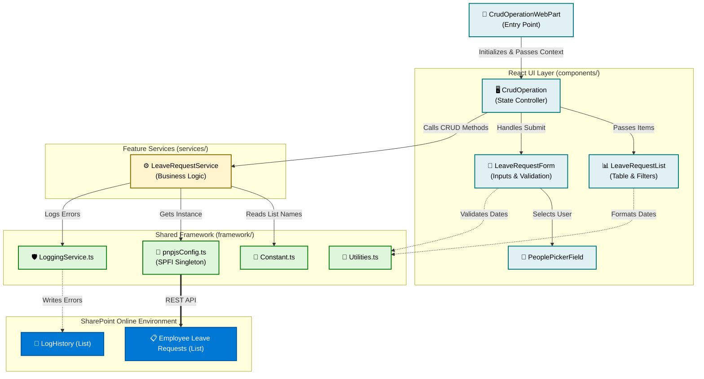
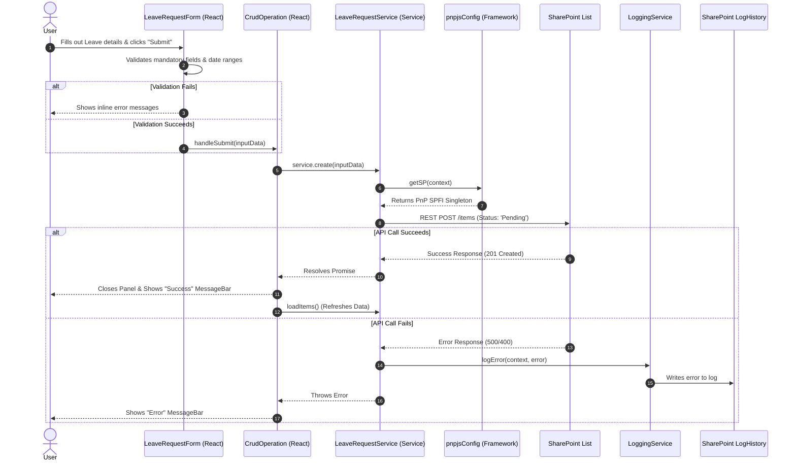

# SPFx Employee Leave Management Architecture & Workflow

This diagram illustrates how data flows through the application, starting from the user interface down to the SharePoint list, utilizing the newly established architectural layers.

## 1. High-Level Architecture & Data Flow

## 2. User Action Workflow (Example: Creating a Leave Request)

